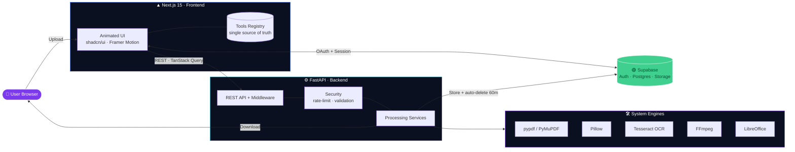
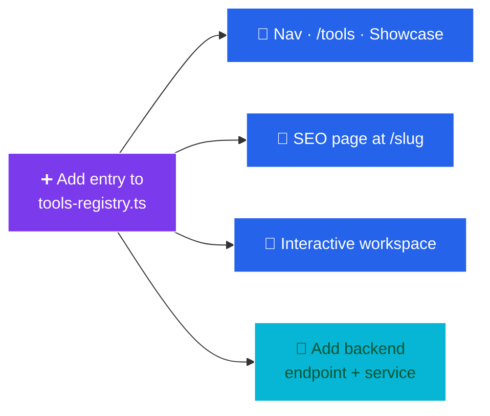

<!-- ════════════════════ HEADER ════════════════════ -->
<div align="center">

<a href="#">
  
</a>

<!-- Animated typing tagline -->
<a href="#">
  
</a>

<br/>

<!-- Tech badges -->
<p>
  
  
  
  
  
  
  
</p>

<!-- Repo stats -->
<p>
  <a href="https://github.com/prithwiraj84/All-in-one-Converter/stargazers"></a>
  <a href="https://github.com/prithwiraj84/All-in-one-Converter/network/members"></a>
  <a href="https://github.com/prithwiraj84/All-in-one-Converter/issues"></a>
  <a href="https://github.com/prithwiraj84/All-in-one-Converter/commits"></a>
  
  
</p>

<p>
  <a href="#-quick-start-local"><b>🚀 Quick Start</b></a> &nbsp;·&nbsp;
  <a href="#-tool-catalogue"><b>🧰 Tools</b></a> &nbsp;·&nbsp;
  <a href="#-architecture"><b>🏗️ Architecture</b></a> &nbsp;·&nbsp;
  <a href="#-tech-stack"><b>🧱 Stack</b></a> &nbsp;·&nbsp;
  <a href="#-deployment"><b>🐳 Deploy</b></a>
</p>

</div>

<!-- ════════════════════ INTRO ════════════════════ -->

> **All Your File Tools. One Powerful Platform.**
>
> A production-grade, full-stack SaaS for **converting, compressing, editing and optimizing**
> PDFs, documents, images, audio, video, archives and fonts — a modern, self-hostable
> alternative to **iLovePDF · Smallpdf · CloudConvert · TinyWow**.

<div align="center">
  
</div>

---

## 📑 Table of Contents

<table>
<tr>
<td valign="top" width="50%">

- [✨ Highlights](#-highlights)
- [🧰 Tool Catalogue](#-tool-catalogue)
- [🏗️ Architecture](#-architecture)
- [🔄 How It Works](#-how-it-works)
- [🧱 Tech Stack](#-tech-stack)

</td>
<td valign="top" width="50%">

- [📁 Project Structure](#-project-structure)
- [🚀 Quick Start (Local)](#-quick-start-local)
- [🐳 Deployment](#-deployment)
- [🔐 Supabase Setup](#-supabase-setup)
- [🧩 Adding a New Tool](#-adding-a-new-tool) · [✅ Testing](#-testing) · [🗺️ Roadmap](#-roadmap)

</td>
</tr>
</table>

---

## ✨ Highlights

<table>
<tr>
<td width="33%" valign="top">

### 🧰 100+ Tools
Across **PDF, Document, Image, OCR, Archive, Audio, Video, Font & AI** categories — all from a single platform.

</td>
<td width="33%" valign="top">

### ⚡ Data-Driven
Every tool page, SEO landing page, nav menu and showcase is generated from **one source of truth** — the tools registry.

</td>
<td width="33%" valign="top">

### 🎨 Premium UI
Glassmorphism, animated gradients, scroll reveals, count-up stats & floating cards — *Linear / Stripe / Vercel*-inspired.

</td>
</tr>
<tr>
<td width="33%" valign="top">

### 🛠️ Real Processing
`pypdf` & `PyMuPDF`, `Pillow`, `Tesseract`, `LibreOffice`, `FFmpeg`, `fontTools` — actual file work, not mocks.

</td>
<td width="33%" valign="top">

### 🔐 Secure by Default
Per-IP rate limiting, upload validation, hardening headers, **auto file deletion** & a malware-scan hook.

</td>
<td width="33%" valign="top">

### 🔎 SEO-Ready
Per-tool metadata, OpenGraph, JSON-LD (WebApplication + FAQ + Breadcrumb), sitemap & robots.

</td>
</tr>
</table>

<div align="center">

| 📂 Files Processed | 🧰 Tools | ⏱️ Uptime | 😀 Happy Users |
|:---:|:---:|:---:|:---:|
| **1M+** | **100+** | **99.9%** | **50K+** |

</div>

---

## 🧰 Tool Catalogue

> Tools are defined declaratively in [`frontend/src/lib/tools-registry.ts`](frontend/src/lib/tools-registry.ts) and routed to dedicated backend services. Add one entry → it shows up everywhere automatically.

<div align="center">

| Category | Examples | Powered by |
|:---|:---|:---|
| 📄 **PDF** | Merge · Split · Compress · PDF → Word · Word → PDF · Protect | `pypdf` · `PyMuPDF` |
| 📝 **Document** | Word / Excel / PowerPoint ⇄ PDF · format conversion | `LibreOffice` · `openpyxl` |
| 🖼️ **Image** | Convert · Compress · Resize · WebP / PNG / JPG / TIFF | `Pillow` |
| 🔍 **OCR** | Image → Text · Searchable PDF | `Tesseract` · `pdfplumber` |
| 🗜️ **Archive** | Create / Extract ZIP · TAR | `zipfile` · `tarfile` |
| 🎵 **Audio** | Convert · MP3 / WAV / FLAC | `FFmpeg` |
| 🎬 **Video** | Convert · MP4 / WebM / MOV | `FFmpeg` |
| 🔤 **Font** | Convert · TTF / OTF / WOFF | `fontTools` |
| 🤖 **AI** | Smart document utilities | — |

</div>

<details>
<summary><b>🔌 Backend routers (click to expand)</b></summary>

<br/>

```
backend/app/routers/
├── pdf.py        # merge, split, compress, convert, protect
├── document.py   # office ⇄ pdf conversions
├── image.py      # convert, compress, resize
├── ocr.py        # text extraction, searchable pdf
├── archive.py    # zip / tar create + extract
├── audio.py      # audio transcoding
├── video.py      # video transcoding
├── font.py       # font format conversion
├── ai.py         # AI-assisted utilities
├── files.py      # upload / download / lifecycle
└── health.py     # liveness + dependency checks
```

> 💡 Any tool whose system binary (FFmpeg / Tesseract / LibreOffice) is missing returns a **clear `503`** — the rest of the platform keeps working.

</details>

---

## 🏗️ Architecture



---

## 🔄 How It Works


1. **Upload** — drag & drop or browse; 100+ formats supported.
2. **Process** — pick your options; the optimized engine does the heavy lifting in seconds.
3. **Download** — grab the converted file instantly.
4. **Auto-delete** — every uploaded & processed file is permanently removed within 60 minutes.

---

## 🧱 Tech Stack

<div align="center">

| Layer | Technologies |
|:---|:---|
| **Frontend** | Next.js 15 (App Router) · TypeScript · Tailwind CSS · shadcn/ui (Radix) · Framer Motion · TanStack Query · React Hook Form · Zod · Lucide |
| **Backend** | FastAPI · Python 3.12 · pypdf · PyMuPDF · Pillow · pytesseract · pdfplumber · openpyxl · fontTools |
| **Auth & Data** | Supabase — Postgres · Auth (Email + Google + GitHub OAuth) · Storage |
| **Media engines** | FFmpeg · Tesseract OCR · LibreOffice *(system binaries)* |
| **Infra** | Docker · docker-compose · Render blueprint |

</div>

---

## 📁 Project Structure

```text
all-in-one-converter/
├── frontend/                     # ▲ Next.js 15 app
│   └── src/
│       ├── app/
│       │   ├── (marketing)/      # landing + /tools + /[slug] tool pages
│       │   ├── (auth)/           # login / signup / forgot-password
│       │   ├── auth/callback/    # Supabase OAuth callback
│       │   ├── dashboard/        # protected dashboard
│       │   └── layout.tsx · globals.css · sitemap.ts · robots.ts
│       ├── components/           # ui/ landing/ tools/ layout/ dashboard/ shared/ seo/
│       ├── lib/                  # tools-registry · site-config · api · supabase · utils · types
│       └── hooks/ · providers/ · middleware.ts
│
├── backend/                      # ⚙️ FastAPI app
│   └── app/
│       ├── main.py               # entrypoint (CORS, middleware, lifespan)
│       ├── config.py
│       ├── core/                 # security · storage · dependencies · errors
│       ├── routers/              # pdf · document · image · ocr · archive · audio · video · font · ai · files · health
│       ├── services/             # the actual file-processing logic
│       └── schemas/
│
├── supabase/schema.sql           # tables · RLS · signup trigger · storage bucket
└── docker-compose.yml · render.yaml · .env.example · DEPLOYMENT.md
```

---

## 🚀 Quick Start (Local)

### Prerequisites


> For full functionality, put **FFmpeg**, **Tesseract OCR** and **LibreOffice** on your `PATH`.
> Tools whose binary is missing return a clear `503` — everything else keeps working.

### 1 · Backend

```bash
cd backend
python -m venv .venv
# Windows:  .venv\Scripts\activate     |  macOS/Linux:  source .venv/bin/activate
pip install -r requirements.txt
cp .env.example .env
uvicorn app.main:app --reload --port 8000
```

📚 API docs → **http://localhost:8000/docs**

### 2 · Frontend

```bash
cd frontend
npm install
cp .env.local.example .env.local   # fill in NEXT_PUBLIC_SUPABASE_* and NEXT_PUBLIC_API_URL
npm run dev
```

🌐 App → **http://localhost:3000**

---

## 🐳 Deployment

<details open>
<summary><b>🐳 Docker Compose (recommended — everything bundled)</b></summary>

<br/>

```bash
cp backend/.env.example backend/.env
cp .env.example .env                 # set NEXT_PUBLIC_SUPABASE_URL / _ANON_KEY
docker compose up --build
```

| Service | URL |
|:---|:---|
| 🌐 Frontend | http://localhost:3000 |
| ⚙️ Backend  | http://localhost:8000 |

> The backend image bundles **FFmpeg, Tesseract and LibreOffice**, so **every tool works out of the box** in Docker.

</details>

<details>
<summary><b>☁️ Render (one-click blueprint)</b></summary>

<br/>

Deploy both services with the included [`render.yaml`](render.yaml) blueprint. See **[DEPLOYMENT.md](DEPLOYMENT.md)** for the full, step-by-step guide.

</details>

---

## 🔐 Supabase Setup

1. Create a project at **[supabase.com](https://supabase.com)**.
2. Run [`supabase/schema.sql`](supabase/schema.sql) in the SQL editor.
3. **Authentication → Providers**: enable **Email**, **Google** and **GitHub**. Add the redirect URL
   `http://localhost:3000/auth/callback` (and your production equivalent).
4. Copy your **Project URL** + **anon key** into the frontend env, and the **service-role key** into the backend env *(server-only)*.

<details>
<summary><b>🔑 Environment variables (click to expand)</b></summary>

<br/>

**Frontend** (`frontend/.env.local`)

| Variable | Purpose |
|:---|:---|
| `NEXT_PUBLIC_SUPABASE_URL` | Supabase project URL |
| `NEXT_PUBLIC_SUPABASE_ANON_KEY` | Public anon key |
| `NEXT_PUBLIC_API_URL` | Backend base URL (e.g. `http://localhost:8000`) |
| `NEXT_PUBLIC_SITE_URL` | Public site URL (for SEO / sitemap) |

**Backend** (`backend/.env`)

| Variable | Purpose |
|:---|:---|
| `SUPABASE_URL` | Supabase project URL |
| `SUPABASE_SERVICE_ROLE_KEY` | Server-only service-role key |
| `ALLOWED_ORIGINS` | CORS allow-list |

> 📖 Full reference lives in [`.env.example`](.env.example) and [DEPLOYMENT.md](DEPLOYMENT.md).

</details>

---

## 🧩 Adding a New Tool



Append one entry to `TOOLS` in [`frontend/src/lib/tools-registry.ts`](frontend/src/lib/tools-registry.ts) (slug, title, category, icon, accept, endpoint, options, SEO copy) — and it automatically appears in the nav, the `/tools` index, the homepage showcase, and gets its own SEO page at `/<slug>` with an interactive workspace. Then add the matching endpoint + service function in the backend.

---

## ✅ Testing

```bash
cd backend && pytest          # backend unit tests
cd frontend && npm run build  # type-check + production build
```

---

## 🗺️ Roadmap

- [x] Data-driven tool registry & SEO pages
- [x] Real file processing across 9 categories
- [x] Supabase auth + protected dashboard
- [x] Dockerized frontend & backend + Render blueprint
- [ ] Batch processing & job queue
- [ ] Public REST API (Business tier)
- [ ] Team workspaces & roles

---

## 🤝 Contributing

Contributions are welcome! Open an [issue](https://github.com/prithwiraj84/All-in-one-Converter/issues) to discuss a change, or send a PR.

1. Fork the repo & create a branch — `git checkout -b feat/amazing-tool`
2. Commit your changes — `git commit -m "feat: add amazing tool"`
3. Push & open a Pull Request 🎉

---

## 📄 License

Released under the **MIT License** — build something great. ✨

<!-- ════════════════════ FOOTER ════════════════════ -->
<div align="center">

<br/>

<sub>Built with ❤️ using Next.js, FastAPI & Supabase</sub>

<br/><br/>

<a href="#-table-of-contents">⬆️ Back to top</a>


</div>